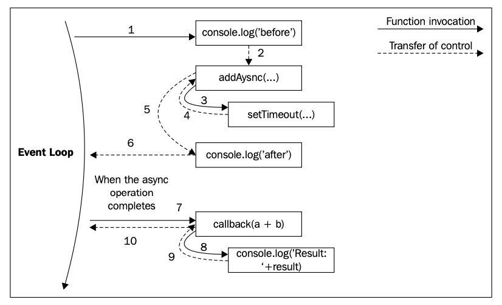

# The callback pattern

- 리액터 패턴의 핸들러를 실체화한 것이 콜백(callback)이다. 콜백은 Node.js의 특징 중 하나이다. 콜백은 작업 결과를 전파하도록 호출되는 함수여서 비동기 처리에 적합하다.
- 동기적인 `return` 명령어를 대신한다.
- JavaScript는 콜백을 대표하는 언어 중 하나인데, 그 이유는 함수가
  - 일급 객체이며,
  - 변수에 할당 가능하고,
  - 인자를 넘길 수 있으며,
  - 다른 함수 호출로부터 반환되고
  - 자료 구조에 저장될 수 있기 때문이다.
- 또한 **클로저(closure)**는 콜백을 구현하기 위한 이상적인 구조체다. 클로저를 사용해 우리는
  - 함수가 생성된 시점의 환경을 참조할 수 있고,
  - 콜백 호출 시점과 관계없이 비동기 작업이 요청된 컨텍스트를 유지할 수 있다.

## The continuation-passing style

- JavaScript에서 callback이란 작업이 끝났을 때 그 결과와 함께 다른 함수에 인자로 넘겨지는 함수를 말한다.
- 함수형 프로그래밍에서 이렇게 결과를 전파하는 방식을 continuation-passing style(CPS)라고 칭한다.
- 무조건 비동기적인 것은 아니며, 호출자에게 결과를 직접 반환하는 대신 콜백 함수에 전달하는 것을 가리킨다.

### Synchronous continuation-passing style

- 컨셉을 이해하기 위해 아래 간단한 동기 함수를 살펴보자.

```js
function add(a, b) {
  return a + b;
}
```

- `return`을 사용해 곧바로 호출자에게 결과를 반환하였다.
- 이를 direct style이라고도 부르며 대부분의 동기적 프로그래밍이 이러한 방식을 따른다.
- CPS로는 아래와 같이 쓸 수 있다.

```js
function add(a, b, callback) {
  callback(a + b);
}
```

- `add()` 함수는 동기적 CPS 함수다.
- 콜백 함수가 실행되어야 `add()` 함수의 결과를 반환할 수 있디.

```js
console.log('before');
add(1, 2, function (result) {
  console.log('Result: ' + result);
});
console.log('after');
```

- `add()`가 동기적이므로 결과는 아래와 같이 순차적으로 처리된다.

```sh
before
Result: 3
after
```

### Asynchronous continuation-passing style

- `add()` 함수가 비동기적인 경우를 생각해보자.

```js
function addAsync(a, b, callback) {
  setTimeout(function () {
    callback(a + b);
  }, 100);
}
```

- `setTimeout()`을 사용해 콜백 함수를 비동기적으로 호출하였다. 이제 아래 코드에서 작업 순서를 살펴보자.

```js
console.log('before');
addAsync(1, 2, function (result) {
  console.log('Result: ' + result);
});
console.log('after');
```

- 결과는 아래와 같다.

```sh
before
after
Result: 3
```

- `setTimeout()`이 비동기적이기 때문에, 콜백 함수가 실행되길 기다리지 않고 즉시 `addAsync()`에게 제어권을 넘겨준다. `addAsync()` 역시 바로 호출자에게 제어권을 넘겨준다.
- 이 방식은 Node.js에서 굉장히 중요한데, 비동기 요청이 보내지자마자 스택이 차례로 되감기되고 제어권이 이벤트 루프로 넘어가는 방식 덕에 큐에 존재하는 새로운 이벤트가 처리될 수 있기 때문이다.



- 비동기 작업이 완료되면 비동기 함수에 있었던 콜백 함수가 다시 실행된다.
- 이벤트 루프에서 시작되므로 스택은 비어있다.
- JavaScript에는 closure가 있어 비동기 함수 호출자의 컨텍스트를 언제든 유지할 수 있다.

> 동기 함수는 작업이 완료될 때까지 기다린다. 비동기 함수는 즉시 반환되고 결과는 이벤트 루프의 이후 사이클에서 핸들러(콜백 함수)에게 넘겨진다.

### Non continuation-passing style callbacks

- `Array` 객체의 `map()` 함수의 경우 비동기 호출도, CPS도 아니다.

```js
var result = [1, 5, 7].map(function (element) {
  return element - 1;
});
```

- 위 콜백 함수는 단순히 배열 내 원소를 순회하기 위해서 사용되었다.
- 콜백 함수의 의도는 보통 API 문서에 설명되어 있으니 확인하자.

## Synchronous or asynchronous?

- 동기 함수인지 비동기 함수인지에 따라 명령어 처리 순서는 달라진다.
- 이는 전체 애플리케이션 흐름에 정확성과 효율성 측면에서 큰 영향을 준다.
- API를 비일관적이고 이해하기 어렵게 만드는 것은 향후 발생할 문제를 파악하기 어렵게 하고 재성성하기에도 어렵다는 점에서 지양해야 한다.

### An unpredictable function

- 가장 위험한 상황 중 하나는 API가 어떤 조건에서는 동기적으로, 또 다른 조건에서는 비동기적으로 작동하는 것이다.

```js
var fs = require('fs');
var cache = {};
function inconsistentRead(filename, callback) {
  if (cache[filename]) {
    // invoked synchronously
    callback(cache[filename]);
  } else {
    // asynchronous function
    fs.readFile(filename, 'utf8', function (err, data) {
      cache[filename] = data;
      callback(data);
    });
  }
}
```

- 위 함수는 `cache` 변수에 파일 읽기 작업 결과를 저장하고 있다.
- 어떤 파일이 캐싱되어 있지 않을 경우 비동기적으로 `fs.readFile()` 함수의 결과를 받아 캐싱한다.
- 파일이 이미 캐싱되어 있을 경우 결과를 바로 콜백 함수에게 넘겨 호출한다.

### Unleashing Zalgo

- 이제 위와 같이 예측할 수 없는 함수가 어떻게 애플리케이션을 망가뜨리는지 살펴보자.

```js
function createFileReader(filename) {
  var listeners = [];
  inconsistentRead(filename, function (value) {
    listeners.forEach(function (listener) {
      listener(value);
    });
  });

  return {
    onDataReady: function (listener) {
      listeners.push(listener);
    },
  };
}
```

- 위 함수가 호출되면, notifier 같은 객체를 생성해, 파일 읽기 작업을 위한 다중 리스너(listener)를 설정할 수 있게 한다.
- 모든 리스너들은 읽기 작업 완료 후 데이터가 가용되면 한 번에 호출 된다.

```js
var reader1 = createFileReader('data.txt');
reader1.onDataReady(function (data) {
  console.log('First call data: ' + data);
  // ...sometime later we try to read again from the same file
  var reader2 = createFileReader('data.txt');
  reader2.onDataReady(function (data) {
    console.log('Second call data: ' + data);
  });
});
```

- 위 코드는 아래와 같은 결과를 출력한다.

```js
First call data: some data
```

- 두 번째 작업은 호출되지 않았다. 이유를 알아보자:
  - `reader1`이 생성되는 동안 `inconsistentRead()` 함수는 캐싱된 결과가 없기 때문에 비동기적으로 동작한다. 이 경우 리스너를 등록할 시간이 충분한데, 읽기 작업이 완료되는대로 이벤트 루프의 다른 사이클에서 리스너들이 호출되기 때문이다.
  - 다음으로 `reader2`는 요청한 파일의 캐싱이 이미 존재한 상태의 이벤트 루프에서 생성된다. 이 경우 `inconsistentRead()`의 내부 호출은 동기적이다. 따라서 콜백 함수는 즉시 호출되는데, `reader2`의 리스너들이 동기적으로 호출된다는 뜻이다. 하지만 리스너들은 `reader2` 생성 이후 등록되기 때문에 호출되지 않는다.
- `inconsistentRead()` 함수의 콜백 호출 방식은 호출 빈도, 인자로 넘겨지는 파일 이름, 파일을 불러오는 데 걸리는 시간 등 여러 가지 변수로 인해 굉장히 예측하기 어렵다.
- 실제 애플리케이션에서 이와 같은 버그를 찾아내고 재생산하는 것은 대단히 어려울 것이다. 웹 서버에서 단순한 함수를 쓰더라도 다중 동시 요청이 들어왔을 때 어떤 요청들은 아무런 이유 없이 또는 에러도 출력되지 않은 채 처리되지 않을 때가 있다. 이는 분명 더러운 결함이다.

### Using synchronous APIs

### Deferred execution

## Node.js callback conventions

### Callbacks come last

### Error comes first

### Propagating errors

### Uncaught exceptions
