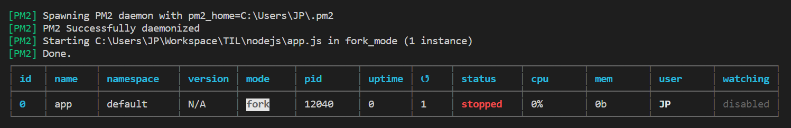

# PM2

> `PM2`를 활용해 `Node.js`를 활용해서 실제 서비스를 무중단으로 운영하기
>
> [참고](https://engineering.linecorp.com/ko/blog/pm2-nodejs/)

## Node.js의 프로세스 매니저 PM2

- Node.js는 싱글 스레드입니다.
- Node.js 애플리케이션은 단일 CPU 코어에서 실행되기 때문에 CPU의 멀티코어 시스템을 사용할 수 없습니다.
- CPU의 멀티코어 시스템을 활용하기 위해 클러스터(Cluster) 모듈을 사용합니다.
- 클러스터 모듈을 사용해서 마스터 프로세스에서 CPU 코어 수만큼 워커 프로세스를 생성해서 모든 코어를 사용합니다.
- 애플리케이션을 실행하면 처음에는 마스터 프로세스만 생성됩니다.
- CPU 개수만큼 워커 프로세스를 생성하고 마스터 프로세스와 워커 프로세스가 각각 수행해야 할 일들을 정리해서 구현합니다.
  - 워커 프로세스가 생성됐을 때 온라인 이벤트가 마스터 프로세스로 전달되면 어떻게 처리할지
  - 워커 프로세스가 메모리 제한선에 도달하거나 예상치 못한 오류로 종료되면서 종료(exit) 이벤트를 전달할 땐 어떻게 처리할지
  - 애플리케이션의 변경을 반영하기 위해 재시작해야 할 때 어떤 식으로 재시작을 처리할 지

> `PM2`라는 Node.js의 프로세스 매니저를 적용해 이런 작업들을 해결할 수 있습니다.


## 설치 방법

Node.js의 패키지 매니저인 `npm`으로 설치합니다.

```shell
$ npm install -g pm2@latest
```


## 기본 사용 방법

아래 '코드1'을 완성된 애플리케이션이라고 가정합니다.

```javascript
//코드1. 예시 애플리케이션
//app.js
const express = require('express')
const app = express()
const port = 3000
app.get('/', function (req, res) { 
  res.send('Hello World!')
})
app.listen(port, function () {
  console.log(`application is listening on port ${port}...`)
})
```

위 '코드1'의 애플리케이션은 아래 '코드2'의 명령어로 데몬화(daemonize)하고 모니터링할 수 있습니다.

```shell
#코드2. 명령어
$ pm2 start app.js

[PM2] Spawning PM2 daemon with pm2_home=/Users/gentlejo/.pm2
[PM2] PM2 Successfully daemonized
[PM2] Starting /Users/gentlejo/Projects/maso/app.js in fork_mode (1 instance)
[PM2] Done.
```



'코드2'처럼 아무런 옵션없이 애플리케이션을 실행하면 `PM2`는 **기본 모드인 포크(fork) 모드**로 애플리케이션을 실행합니다. 앞서 언급한 것처럼 모든 CPU를 사용하기 위해서는 애플리케이션을 **클러스터 모드**로 실행해야 합니다. 아래 '코드3'와 같이 간단하게 설정파일을 만들어보겠습니다.

```javascript
//코드3. 설정파일
//ecosystem.config.js
module.exports = {
  	apps: [{
  	name: 'app',
  	script: './app.js',
  	instances: 0,
  	exec_mode: 'cluster'
  }]
}
```

완성된 설정파일을 활용해 애플리케이션을 클러스터 모드로 실행할 수 있습니다. `exec_mode` 항목값을 `cluster`로 설정하면 애플리케이션을 클러스터 모드로 실행하겠다는 의미이고, `instance` 항목값을 `0`으로 설정하면 CPU 코어 수만큼 프로세스를 생성하겠다는 뜻입니다.

```shell
//코드4. 설정파일 실행
$ pm2 start ecosystem.config.js
[PM2][WARN] Applications app not running, starting...
[PM2] App [app] launched (4 instances)
```

