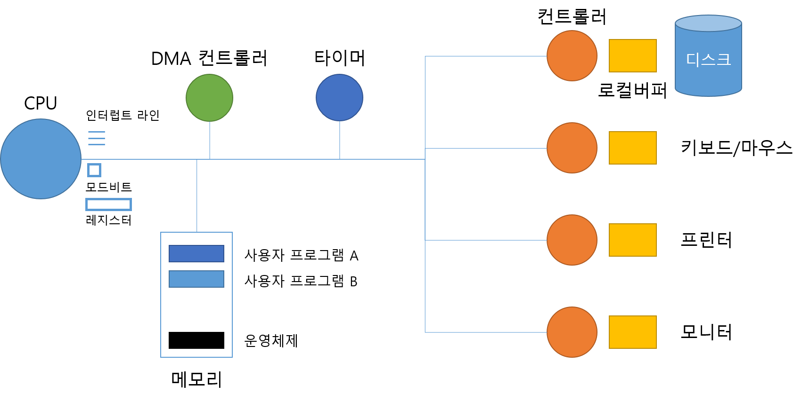
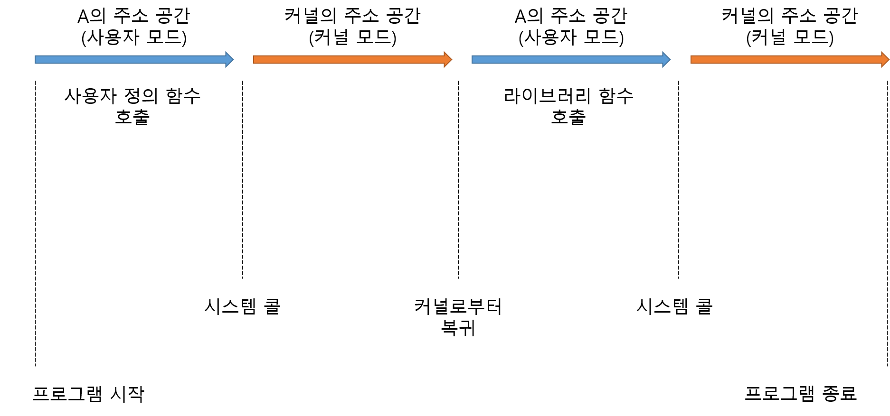
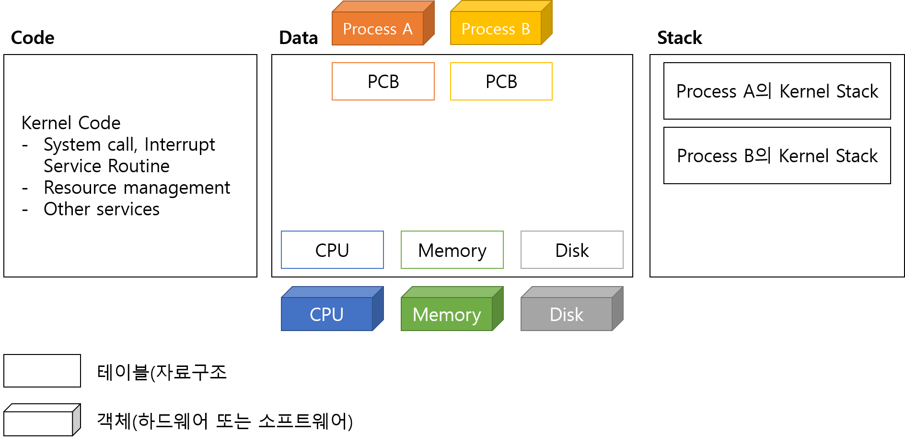

# System Structure & Program Execution

> 하드웨어 위에서 프로그램이 어떻게 돌아가는가

## 목차

- [컴퓨터 시스템 구조](#컴퓨터-시스템-구조)
- [Mode bit](#mode-bit)
- [Timer](#timer)
- [Device Controller](#device-controller)
- [입출력(I/O)의 수행](#입출력io의-수행)
- [Interrupt](#interrupt)
- [동기식 입출력과 비동기식 입출력](#동기식-입출력과-비동기식-입출력)
- [DMA Controller](#dma-controller)
- [서로 다른 입출력 명령어](#서로-다른-입출력-명령어)
- [저장장치 계층 구조](#저장장치-계층-구조)
- [프로그램의 실행](#프로그램의-실행)
- [커널 주소 공간의 내용](#커널-주소-공간의-내용)
- [사용자 프로그램이 사용하는 함수](#사용자-프로그램이-사용하는-함수)


## 컴퓨터 시스템 구조

> 운영체제는 컴퓨터가 부팅되었을 때부터 항상 수행되면서 각종 자원들을 관리해야 하므로 항상 메모리에 올라가 있다. 메모리 낭비를 막기 위해 핵심적인 부분만 한정하여 메모리에 항상 올라가 있는 부분을 **커널(kernel)**이라고 부른다.



| Computer    | I/O device                             |
| ----------- | -------------------------------------- |
| CPU, Memory | Disk, Monitor, Keyboard, Printer, etc. |

- **CPU**는 매 클럭마다 Memory에서 **기계어(instruction)**를 읽어 명령을 실행
  - CPU Register에 있는 Program Counter(PC)가 가리키는 메모리 주소에 있는 기계어를 실행
- Register는 Memory 보다 빠른 저장 공간
- Mode bit은 CPU에서 실행되는 프로그램이 운영체제인지 사용자 프로그램인지 구분
- interrupt line
  - Disk와 같은 I/O device는 처리 속도가 CPU에 비해 굉장히 느림
  - I/O device에 접근하는 것은 운영체제를 통해서만 가능(보안 등의 이유로)
  - 어떤 프로그램이 Disk에 있는 정보를 읽어와야 할 때 해당 프로그램은 Disk controller에 정보를 요청
  - 그러다가 **Disk controller가 정보를 찾으면(수행이 끝나면) 해당 정보는 local buffer에 입력되게 되고, controller가 interrupt를 발생**시킴
  - **CPU는 하나의 instruction이 끝나고나면 interrupt line을 check하고, interrupt가 존재하면 CPU의 권한을 운영체제에게 넘겨주게 됨**
  - 운영체제는 I/O device의 buffer에 있는 정보를 가져와서 main memory에 복사하고, CPU 권한을 다시 그 전에 interrupt 당한 프로그램에게 넘겨주게 됨
- timer에는 각 프로그램이나 운영체제가 CPU의 권한을 가질 할당 시간을 정해놓는 곳
- device controller
- local buffer


## Mode bit

- 사용자 프로그램의 잘못된 수행으로 메모리 영역이나 파일 영역을 침범하여 다른 프로그램 및 운영체제에 피해가 가지 않도록 하기 위한 보호 장치 필요

- Mode bit을 통해 하드웨어적으로 두 가지 모드의 operation 지원

  ```
  1 == 사용자 모드: 사용자 프로그램이 실행되며 제한적인 명령만 수행
  0 == 모니터 모드: OS가 CPU의 제어권을 가지고 모든 종류의 명령을 수행
  ```

  - **사용자 모드**에서는 메모리에서 자료를 읽어와 CPU에서 계산하고 결과를 메모리에 쓰는 **일반명령**을 수행할 수 있다.
  - **모니터 모드**(또는 **커널 모드, 시스템 모드**라고도 함)에서는 보안이 필요한 입출력 장치, 타이머 등에 접근하는 **특권명령**을 수행할 수 있다.
  - Interrupt나 Exception, 시스템 콜 발생 시 하드웨어가 mode bit을 0으로 바꿈
  - 사용자 프로그램에게 CPU를 넘기기 전에 mode bit을 1로 세팅


## Timer

- 타이머
  - 정해진 시간이 흐른 뒤 운영체제에게 제어권이 넘어가도록 인터럽트를 발생시킴
  - 타이머는 매 클럭 틱 때마다 1씩 감소
  - 타이머 값이 0이 되면 타이머 인터럽트 발생
  - CPU를 특정 프로그램이 독점하는 것으로부터 보호
- 타이머는 time sharing을 구현하기 위해 널리 이용됨
- 타이머는 현재 시간을 계산하기 위해서도 사용


## Device Controller

- I/O device controller
  - 해당 I/O 장치유형을 관리하는 일종의 작은 CPU
  - 제어 정보를 위해 control register, status register를 가짐
  - **local buffer**를 가짐 (일종의 data register)
    - 장치로부터 들어오고 나가는 데이터를 임시로 저장하기 위한 작은 메모리
- I/O는 실제 device와 local buffer 사이에서 일어남
- Device controller는 I/O가 끝났을 경우 interrupt로 CPU에 그 사실을 알림

- device driver(장치구동기)
  - OS 코드 중 각 장치별 처리루틴 -> software
  - device controller를 작동시키기 위한 코드는 firmware driver
- device controller(장치제어기)
  - 각 장치를 통제하는 일종의 작은 CPU -> hardware


## 입출력(I/O)의 수행

>  모든 입출력 명령은 특권 명령이다. 사용자 프로그램은 어떻게 I/O를 하는가?

### 시스템콜(System call)

- 사용자 프로그램이 운영체제의 서비스를 받기 위해 커널 함수를 호출하는 것
- I/O 접근 및 요청은 운영체제만 가능
- 일반적인 함수호출과는 다르게 Interrupt를 걸어서 CPU 권한이 OS에게 넘어가게 한다.

### 예시

> 디스크의 파일 입출력

1. 사용자 프로그램이 디스크 파일을 읽기 위해 시스템 콜로 커널 함수를 호출
2. trap을 사용하여 인터럽트 벡터의 특정 위치로 이동(인터럽트 라인 세팅)
3. CPU가 다음 명령을 수행하기 전에 인터럽트 발생을 인지하고 CPU의 제어권을 OS로 이양
4. 인터럽트 벡터가 가리키는 인터럽트 서비스 루틴으로 이동
5. OS는 올바른 I/O 요청인지 확인(예. 해당 파일에 대한 접근 권한이 있는지) 후 I/O 수행
6. 대부분의 경우, I/O는 CPU보다 상대적으로 많은 시간이 소요되므로, OS는 I/O 요청 후 CPU 제어권을 다른 프로세스에 이양
7. 다른 프로세스를 수행하던 중 I/O 완료 시 디스크 컨트롤러가 하드웨어 인터럽트를 발생시켜 디스크의 로컬버퍼에서 읽어온 내용을 메모리에 복사
8. I/O를 요청했던 프로세스를 CPU 대기 큐에 삽입하고 CPU 제어권이 인터럽트 당한 프로세스로 넘어가 작업을 계속 수행


## Interrupt

> 인터럽트는 인터럽트 당한 시점의 레지스터와 program counter를 save한 후 CPU의 제어를 인터럽트 처리 루틴에 넘기는 것이다.
>
> 운영체제 커널에는 인터럽트가 들어왔을 때 해야 할 일이 미리 다 프로그래밍되어 그 코드가 보관돼 있다.
>
> 현대의 운영체제는 인터럽트에 의해 구동된다.

### 넓은 의미

#### Interrupt (하드웨어 인터럽트)

- 통상적으로 인터럽트라고 하면 하드웨어가 발생시킨 인터럽트를 의미
- I/O 장치가 정보 교신을 하기 위해

#### Trap (소프트웨어 인터럽트)

- Exception(예외상황): 프로그램이 오류를 범한 경우
  - 0으로 나누는 연산 등 비정상적인 작업을 시도할 때
  - 자신의 메모리 영역 바깥에 접근하려는 시도 등 권한이 없는 작업을 시도할 때
- System call: 프로그램이 커널 함수를 호출하는 경우(사용자 프로그램이 직접 처리하지 못하고 OS의 도움을 받아야 할 때)

### 인터럽트 관련 용어

#### 인터럽트 벡터

- 해당 인터럽트의 처리 루틴 주소를 가지고 있음
- 인터럽트의 번호와 주소의 쌍

#### 인터럽트 처리 루틴(=Interrupt Service Routine, 인터럽트 핸들러)

- 해당 인터럽트를 처리하는 커널 함수(실제 코드)

- 예를 들어, disk에서 어떤 자료를 읽는 정보를 완료했을 때 인터럽트를 발생시키면, 인터럽트 3번 라인이 세팅이 된다. 3번 라인에 있는 주소는 디스크 로컬 버퍼에 있는 정보를 가져오는 처리 루틴 함수를 가리킨다. 인터럽트 종류마다 처리루틴 함수의 주소를 가리키는 인터럽트 벡터가 존재한다.

#### 인터럽트 핸들링

> 인터럽트가 발생한 경우에 처리해야 할 일의 절차

1. 프로그램 A가 실행되고 있을 때 인터럽트 발생
2. A의 **현재 상태**를 PCB에 저장
   - 현재 CPU에서 실행 중이던 명령의 메모리 주소
   - 레지스터값
   - 하드웨어 상태
3. CPU의 제어권이 인터럽트 처리루틴으로 넘어감
4. 인터럽트 처리가 끝나면 저장된 상태를 PCB로부터 CPU 상에 복원
5. 인터럽트 발생 직전 위치부터 프로그램 A 다시 실행


## 동기식 입출력과 비동기식 입출력

> 두 경우 모두 I/O의 완료는 인터럽트로 알려줌

### 동기식 입출력(synchronous I/O)

- I/O 요청 후 입출력 작업이 완료된 후에야 제어가 사용자 프로그램에 넘어감
- I/O 결과를 계속 지켜봐야하는 프로그램에서 해당 방식 사용
- 구현 방법 1
  - I/O가 끝날 때까지 CPU를 낭비시킴
  - 매시점 하나의 I/O만 일어날 수 있음
- 구현 방법 2
  - I/O가 완료될 때까지 해당 프로그램에게서 CPU를 빼앗음
  - I/O 처리를 기다리는 줄에 그 프로그램을 줄 세움
  - 다른 프로그램에게 CPU를 줌

### 비동기식 입출력(asynchronous I/O)

- I/O가 시작된 후 입출력 작업이 끝나기를 기다리지 않고 제어가 사용자 프로그램에 즉시 넘어감


## DMA Controller

> I/O 장치가 많아질수록 CPU에 걸리는 Interrupt가 증가해서 overhead 발생, 이는 효율적이지 않다. DMA(Direct Memory Access) Controller가 그 역할을 대신 처리해서 local buffer의 내용이 모두 main memory에 복사가 되거나 했을 경우 CPU에 인터럽트를 걸어 알려줌

- 빠른 입출력 장치를 메모리에 가까운 속도로 처리하기 위해 사용
- CPU의 중재 없이 device controller가 device의 buffer storage의 내용을 메모리에 block 단위로 직접 전송
- 바이트 단위가 아니라 block 단위로 인터럽트를 발생시킴


## 서로 다른 입출력 명령어

- I/O를 수행하는 special instruction에 의해
  - Memory 접근 instruction과 I/O device 접근 instruction이 따로 존재
- Memory Mapped I/O에 의해
  - I/O 장치도 Memory 주소의 연장 주소를 붙여서, 연장된 메모리 주소에 I/O device 접근 instruction을 저장


## 저장장치 계층 구조

### Primary(Executable)

- Registers (Fast, Expensive=Small size, Volatile)
- Cache Memory
- Main Memory

### Secondary

- Magnetic Disk
- Optical Disk
- Magnetic Tape (Slow, Cheap, non-volatile)

```
Caching: copying information into faster storage system
```


## 프로그램의 실행

> '프로그램이 실행되고 있다(program execution)'는 것은 컴퓨터 시스템 차원에서 볼 때 크게 두 가지 의미로 볼 수 있다.
>
> 1. 디스크에 존재하던 실행파일이 메모리에 적재된 상태
> 2. 프로그램이 CPU를 할당받고 명령(instruction)을 수행하고 있는 상태

### 메모리 load 과정

1. File system의 실행파일을 실행
2. 프로그램의 Address space, **독자적인 주소공간(Code, data, stack, heap으로 구성된 가상 메모리 또는 논리적 메모리)**이 생성됨
3. 가상 메모리의 당장 필요한 부분만 물리적 메모리(Physical memory)에 올려놓는다.
4. 물리적 메모리에 올려지지 않은 부분은 **스왑 영역(swap area, 물리적 메모리의 연장공간)**에 놓는다.

### 프로세스의 두 가지 실행 상태

> A 프로그램을 실행하면 user mode와 kernel mode를 반복하다가 프로그램이 종료된다.



### user mode

- 프로그램이 직접 CPU를 잡고 있음
- 사용자 정의 함수 호출
- 라이브러리 함수 호출
- 시스템 콜을 하면 커널 모드로 진입

### kernel mode

- 시스템 콜로 인해 진입
- 커널 함수가 반환되면 다시 유저 모드로 진입


## 커널 주소 공간의 내용



### code

커널 코드

- 시스템콜, 인터럽트 처리 코드
- 자원 관리를 위한 코드
- 편리한 서비스 제공을 위한 코드

### data

- cpu, mem, disk와 같은 하드웨어 관리 -> 종류마다 자료구조를 만들어 관리
- 프로세스 관리 -> 각 프로그램마다 os가 관리할 자료구조인 PCB를 만들어 관리

### stack

- 함수 호출 시 복귀 주소를 저장하기 위한 용도
- 프로세스마다 별도의 스택을 두어 관리


## 사용자 프로그램이 사용하는 함수

### 사용자 정의 함수

- 자신의 프로그램에서 정의한 함수

### 라이브러리 함수

- 누군가 미리 작성해놓아 호출만 하여 사용하는 함수
- 자신의 프로그램의 실행 파일에 포함되어 있다.

> 사용자 정의 함수와 라이브러리 함수는 프로그램이 실행될 때 **해당 프로세스의 주소 공간에 포함**되며, **함수호출 시에도 자신의 주소 공간에 있는 스택을 사용**하게 된다.

### 커널 함수

- 운영체제 프로그램의 함수
- 커널 함수의 호출 = 시스템 콜 함수
- 각종 하드웨어 및 소프트웨어가 CPU의 서비스를 요청하기 위해 발생시키는 인터럽트 처리 함수
- OS 커널의 주소 공간에 코드가 정의


