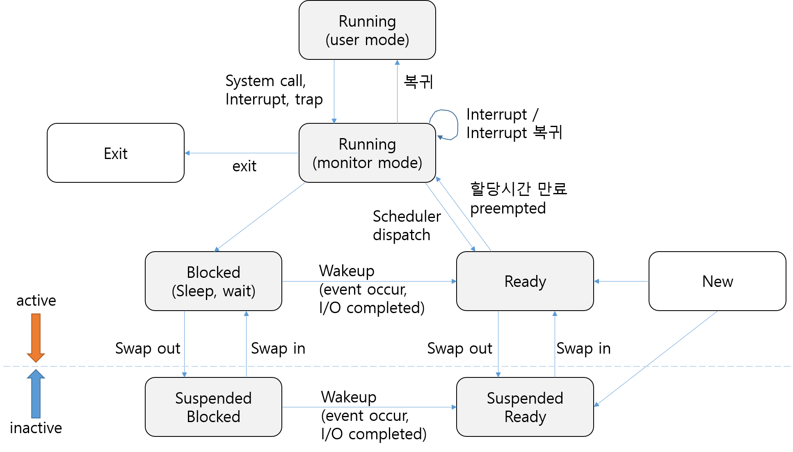

# Process

> Process is **a program in execution**

## 프로세스의 개념

### 프로세스의 문맥(Context)

> 프로세스의 현재 상태를 나타내는데 필요한 모든 것

- CPU 수행 상태를 나타내는 하드웨어 문맥
  - Program Counter
  - 각종 Register
- 프로세스의 주소 공간
  - code, data, stack
- 프로세스 관련 커널 자료 구조
  - PCB(Process Control Block)
  - Kernel stack

## 프로세스의 상태(Process State)

> 프로세스는 상태(state)가 변경되며 수행된다
>
> - New: 프로세스가 생성 중인 상태
> - Terminated: 수행(execution)이 끝난 상태

### Running

- CPU를 잡고 instruction을 수행 중인 상태

### Ready

- CPU를 기다리는 상태(메모리 등 다른 조건을 모두 만족하고)

### Blocked(wait, sleep)

- CPU를 주어도 당장 instruction을 수행할 수 없는 상태
- Process 자신이 요청한 event(예: I/O)가 즉시 만족되지 않아 이를 기다리는 상태
- Process를 실행하기 위한 부분이 swap area에 있는 경우
- 디스크에서 file을 읽어와야 하는 경우

### Suspended(stopped)

- 외부적인 이유로 프로세스의 수행이 정지된 상태
- 프로세스는 통째로 디스크에 swap out된다.
- 예. 사용자가 프로그램을 일시정지시킨 경우(break key) 시스템이 여러 이유로 프로세스를 잠시 중단시킴(메모리에 너무 많은 프로세스가 올라와 있을 때)

### Blocked vs. Suspended

- Blocked: 자신이 요청한 event가 만족되면 Ready
- Suspended: 외부에서 resume해주어야 Active

## 프로세스 상태도

- `new` -> admitted -> `ready(in memory)` -> scheduler dispatch -> `running` -> exit -> `terminated`

- `running` -> Timer interrupt(할당 시간 만료) -> `ready`

- `running` -> I/O or event wait -> `waiting(blocked)` -> I/O or event completion -> `ready`

## Process Control Block (PCB)

> 운영체제가 실행 중인 각 프로세스를 관리하기 위해 유지하는 자료구조

### 구성 요소

> 구조체로 유지

1. OS가 관리상 사용하는 정보
   - Process state, Process ID
   - scheduling information, priority
2. CPU 수행 관련 하드웨어 값
   - Program counter, registers
3. 메모리 관련
   - Code, data, stack의 위치 정보
4. 파일 관련
   - Open file descriptors
   - 이 프로세스가 열고 있는 파일들이 무엇인지

## 문맥 교환(Context switch)

- CPU를 한 프로세스에서 다른 프로세스로 넘겨주는 과정
- CPU가 다른 프로세스에게 넘어갈 때 운영체제는 다음을 수행
  - CPU를 내어주는 프로세스의 상태를 그 프로세스의 PCB에 저장
  - CPU를 새롭게 얻는 프로세스의 상태를 PCB에서 읽어옴
- 인터럽트 등으로 프로세스가 교체될 때 해당 프로세스를 이전까지 수행한 지점을 기억해 바로 그 다음부터 수행할 수 있도록 하는 것

### System call이나 Interrupt 발생 시 반드시 context switch가 일어나는 것은 아님

1. 사용자 프로세스 A(user mode) -> ISR or system call 함수(kernel mode) -> 사용자 프로세스 A(user mode)
   - user mode -> kernel mode: **interrupt** or **system call**
   - kernel mode -> user mode: 문맥교환 없이 user mode 복귀
2. 사용자 프로세스 A(user mode) -> (kernel mode) -> 사용자 프로세스 B(user mode)
   - user mode -> kernel mode: **timer interrupt** or I/O 요청 system call
   - kernel mode -> user mode: **문맥 교환** 일어남

> 1의 경우에도 CPU 수행 정보 등 context 일부를 PCB에 save해야 하지만, 문맥교환을 하는 2의 경우 그 부담이 훨씬 큼(예. cache memory flush)

## 프로세스를 스케줄링하기 위한 큐

> 프로세스들은 각 큐들을 오가며 수행된다.

### Job queue

현재 시스템 내에 있는 모든 프로세스의 집합

### Ready queue

현재 메모리 내에 있으면서 CPU를 잡아서 실행되기를 기다리는 프로세스의 집합

### Device queues

I/O device의 처리를 기다리는 프로세스의 집합

## 스케줄러(Scheduler)

### Long-term scheduler(장기 스케줄러 or Job scheduler)

- 시작(new) 프로세스 중 어떤 것들을 **ready queue**로 보낼지 결정
- 프로세스에 **memory(및 각종 자원)**을 주는 문제
- *degree of Multiprogramming*을 제어
- time sharing system에는 보통 장기 스케줄러가 없음(무조건 ready)

### Short-term scheduler(단기 스케줄러 or CPU scheduler)

- 어떤 프로세스를 다음 번에 **running** 시킬지 결정
- 프로세스에 **CPU**를 주는 문제
- 충분히 빨라야 함(millisecond 단위)

### Medium-term scheduler(중기 스케줄러 or Swapper)

- **여유 공간 마련을 위해 프로세스를 통째로 메모리에서 디스크로 쫓아냄**
- 프로세스에게서 **memory**를 뺏는 문제
- *degree of Multiprogramming*을 제어

