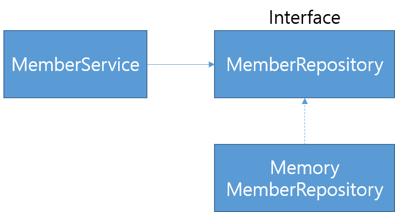

# 회원 관리 예제 - 백엔드 개발

## 비즈니스 요구사항 정리

- 데이터: 회원 ID, 이름
- 기능: 회원 등록, 조회
- 아직 데이터 저장소가 선정되지 않음(가상의 시나리오)

### 일반적인 웹 어플리케이션 계층 구조


- 컨트롤러: 웹 MVC의 컨트롤러 역할
- 서비스: 핵심 비즈니스 로직 구현
- 리포지토리: 데이터베이스에 접근, 도메인 객체를 DB에 저장하고 관리
- 도메인: 비즈니스 도메인 객체(예. 회원, 주문, 쿠폰 등 주로 DB에 저장하고 관리됨)

### 클래스 의존 관계


- 아직 데이터 저장소가 선정되지 않아서, 우선 인터페이스로 구현 클래스를 변경할 수 있도록 설계
- 데이터 저장소는 RDB, NoSQL 등등 다양한 저장소를 고민 중인 상황으로 가정
- 개발을 진행하기 위해서 초기 개발 단계에서는 구현체로 가벼운 메모리 기반의 데이터 저장소 사용

---

## 회원 Domain과 Repository 만들기

### 파일 구조

```
src/
└─main/
    └─java/
        └─hello.hellospring/
            ├─domain/
            │   └─Member.java
            └─repository/
                ├─MemberRepository.java
                └─MemoryMemberRepository.java
```

### 회원 객체

```java
// domain/Member.java

public class Member {

    private Long id;
    private String name;

    public Long getId() {
        return id;
    }

    public void setId(Long id) {
        this.id = id;
    }

    public String getName() {
        return name;
    }

    public void setName(String name) {
        this.name = name;
    }
}
```

### 회원 Repository Interface

```java
// repository/MemberRepository.java

public interface MemberRepository {
    Member save(Member member);
    Optional<Member> findById(Long id);
    Optional<Member> findByName(String name);
    List<Member> findAll();
}
```

### 회원 Repository Memory 구현체

```java
// repository/MemoryMemberRepository.java

/*
* 동시성 문제가 고려되어 있지 않음, 실무에서는 ConcurrentHashMap, AtomicLong 사용 고려
*/

public class MemoryMemberRepository implements MemberRepository{

    private static Map<Long, Member> store = new HashMap<>();
    private static Long sequence = 0L;

    @Override
    public Member save(Member member) {
        member.setId(++sequence);
        store.put(member.getId(), member);
        return member;
    }

    @Override
    public Optional<Member> findById(Long id) {
        // Optional.ofNullable ==> Null이 반환될 경우 처리
        return Optional.ofNullable(store.get(id));
    }

    @Override
    public Optional<Member> findByName(String name) {
        // .stream() ==> lambda loop 돌면서 찾으면 반환
        return store.values().stream()
                .filter(member -> member.getName().equals(name))
                .findAny();
    }

    @Override
    public List<Member> findAll() {
        return new ArrayList<>(store.values());
    }
}
```

---

## 회원 Repository 테스트 케이스 작성

개발한 기능을 테스트하기 위해 `main` 메서드나 웹 어플리케이션의 컨트롤러를 통해 해당 기능을 실행하는 것은 오래 걸리고, 반복 실행하기 어렵고, 여러 테스트를 한 번에 실행하기 어렵다는 단점이 있다. Java는 `JUnit`, 최근에는 `assertj`라는 프레임워크로 테스트를 실행해서 이러한 문제를 해결한다.

### 파일 구조
```
src/
├─main/
└─test/
    └─java/
        └─hello.hellospring/
            └─repository/
                └─MemoryMemberRepositoryTest.java
```

### 회원 Repository 메모리 구현체 테스트

```java
// repository/MemoryMemberRepositoryTest.java

/*
* 테스트 순서는 보장이 되지 않는다.
* 따라서 각 메소드가 따로 동작하도록 작성해야한다.
* 아니면 각 테스트마다 데이터 Repository를 지워주는 코드가 필요하다!
* */

public class MemoryMemberRepositoryTest {

    MemoryMemberRepository repository = new MemoryMemberRepository();

    // 메서드가 끝날 때마다 동작하는 콜백 함수
    @AfterEach
    public void afterEach() {
        // 저장소를 깔끔하게 지워주지 않으면 에러 발생
        repository.clearStore();
    }

    @Test
    public void save() {
        Member member = new Member();
        member.setName("spring");

        repository.save(member);

        // Optional 타입은 .get()으로 꺼낸다(좋은 방법은 아님)
        Member result = repository.findById(member.getId()).get();

        // 테스트를 직접 출력해서 다 볼 수는 없다
        // soutv 치고 탭 ==> println 단축키
        // System.out.println("(result= " + (result == member));

        // junit.jupiter.api가 제공하는 테스트
        // 기대값, 실제값
        // 같다면 실행했을 때 초록색 체크, 다를 땐 오류
//        Assertions.assertEquals(member, result);

        // assertj 제공 테스트
        // Alt + Enter ==> static import 가능
        assertThat(member).isEqualTo(result);
    }

    @Test
    public void findByName() {
        Member member1 = new Member();
        member1.setName("spring1");
        repository.save(member1);

        // Shift + F6 ==> 블록 내 찾아바꾸기
        Member member2 = new Member();
        member2.setName("spring2");
        repository.save(member2);

        Member result = repository.findByName("spring1").get();

        assertThat(result).isEqualTo(member1);  // 통과
//        assertThat(result).isEqualTo(member2);  // 실패
    }

    @Test
    public void findAll() {
        Member member1 = new Member();
        member1.setName("spring1");
        repository.save(member1);

        Member member2 = new Member();
        member2.setName("spring2");
        repository.save(member2);

        List<Member> result = repository.findAll();

        assertThat(result.size()).isEqualTo(2); // 통과
//        assertThat(result.size()).isEqualTo(3); // 실패
    }
}
```

- `@AfterEach`: 한 번에 여러 테스트를 실행하면 메모리 DB에 직전 테스트의 결과가 남을 수 있다. 이렇게 되면 이전 테스트 때문에 다음 테스트가 실패할 가능성이 있다. `@AfterEach`를 사용하면 각 테스트가 종료될 때마다 이 기능을 실행한다. 여기서는 메모리 DB에 저장된 데이터를 삭제한다.
- 테스트는 각각 독립적으로 실행되어야 한다. 테스트 순서에 의존관계가 있는 것은 좋은 테스트가 아니다.

---

## 회원 서비스 개발

### 파일 구조

```
src/
└─main/
    └─java/
        └─hello.hellospring/
            ├─domain/
            ├─repository/
            └─service/
                └─MemberService.java
```

### 회원 가입, 전체 회원 조회 로직

```java

public class MemberService {
    private final MemberRepository memberRepository = new MemoryMemberRepository();

    // 회원 가입
    public Long join(Member member) {
        // 중복 이름 불가 처리
//        Optional<Member> result = memberRepository.findByName(member.getName());
//        result.ifPresent(m -> {
        // Optional 변수를 쓸 필요 없이 바로 return값에 ifPresent() 실행

//        memberRepository.findByName(member.getName())
//                .ifPresent(m -> {
//                    throw new IllegalStateException("이미 존재하는 회원입니다.");
//                });
        // Ctrl + Alt + M ==> Extract Method: 해당 로직을 함수화
        validateDuplicateMember(member);    // 중복 회원 검증

        memberRepository.save(member);
        return member.getId();
    }

    private void validateDuplicateMember(Member member) {
        memberRepository.findByName(member.getName())
                .ifPresent(m -> {
                    throw new IllegalStateException("이미 존재하는 회원입니다.");
                });
    }

    // 전체 회원 조회
    public List<Member> findMembers() {
        return memberRepository.findAll();
    }

    public Optional<Member> findOne(Long memberId) {
        return memberRepository.findById(memberId);
    }
}
``` 

---

## 회원 서비스 테스트

> 테스트 파일 생성 단축키는 `Ctrl+Shift+T`

### Dependency Injection(DI)

- `MemberService`와 `MemberServiceTest`가 서로 다른 `MemoryMemberRepository` 인스턴스를 사용하고 있어 의존관계를 설정할 필요가 있다.
- 기존 `MemberService`가 `MemoryMemberRepository`를 직접 생성하던 코드를 DI 가능하게 변경

```java
// MemberService.java

public class MemberService {
    //    private final MemberRepository memberRepository = new MemoryMemberRepository();

    // Test와 같은 Repository를 사용하도록 설정
    private final MemberRepository memberRepository;

    // memberRepository를 외부에서 넣어주도록 설정
    public MemberService(MemberRepository memberRepository) {
        this.memberRepository = memberRepository;
    }

...
```

- `@BeforeEach`: 각 테스트 실행 전에 호출되어 테스트가 서로 영향이 없도록 항상 새로운 객체를 생성하고, 의존관계도 새로 맺어준다.

```java
// MemberServiceTest.java


class MemberServiceTest {

//    MemberService memberService = new MemberService();
//    MemoryMemberRepository memoryMemberRepository = new MemoryMemberRepository();
    MemberService memberService;
    MemoryMemberRepository memoryMemberRepository;

    // 각 테스트를 실행하기 전에 같은 memoryRepository를 사용하도록 설정
    // Dependency Injection(DI)
    @BeforeEach
    public void beforeEach() {
        memoryMemberRepository = new MemoryMemberRepository();
        memberService = new MemberService(memoryMemberRepository);
    }

    @AfterEach
    public void afterEach() {
        memoryMemberRepository.clearStore();
    }

    @Test
    void join() {
        // given
        Member member = new Member();
        member.setName("hello");

        // when
        Long saveId = memberService.join(member);

        // then
        Member findMember = memberService.findOne(saveId).get();
        assertThat(member.getName()).isEqualTo(findMember.getName());
    }

    // 테스트 메소드명은 한글로 지을 수 있다
    @Test
    public void 중복회원예외() {
        // given
        Member member1 = new Member();
        member1.setName("spring");

        Member member2 = new Member();
        member2.setName("spring");

        // when
        memberService.join(member1);
        IllegalStateException e = assertThrows(IllegalStateException.class, () -> memberService.join(member2));

        assertThat(e.getMessage()).isEqualTo("이미 존재하는 회원입니다.");

//        try {
//            memberService.join(member2);    // 예외처리가 되어야 함
//            fail();
//        } catch (IllegalStateException e) {
//            assertThat(e.getMessage()).isEqualTo("이미 존재하는 회원입니다.");
//        }

        // then
    }

    @Test
    void findMembers() {
    }

    @Test
    void findOne() {
    }
}
```