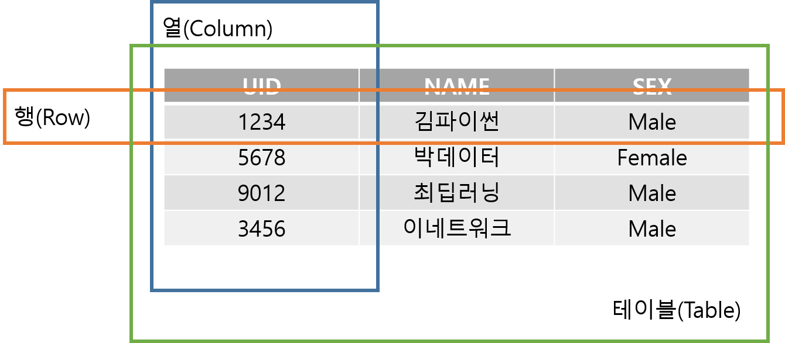
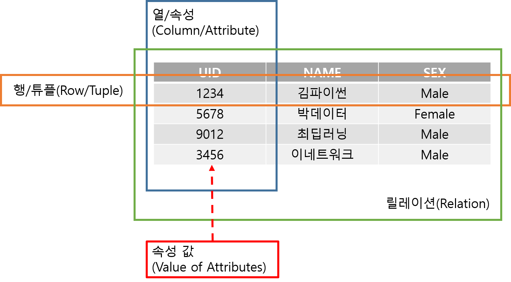

# 데이터베이스 개념

## Table

_관계형 데이터베이스_에서 행과 열로 이루어진 2차원 데이터 구조

## Relation

테이블에 조건이 추가된 개념

릴레이션은 테이블에 포함되는 개념으로, 몇 가지 조건을 더 만족해야 한다. 그 중에는 

- 어떠한 두 개의 행도 동일하지 않다
- 테이블의 셀은 단일 값을 포함한다

가 중요한 특징으로 생각된다.