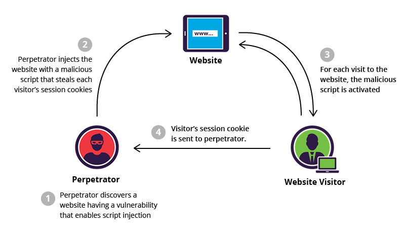

# XSS & CSRF - 주표

# XSS

Cross-site Scripting의 준말로, 공격하려는 웹 사이트에 스크립트를 넣어 쿠키나 개인정보를 해킹하는 기법을 말합니다.

## 과정

- 웹 요청(POST, PUT 등)을 통해 XSS 공격 코드가 웹 어플리케이션에 전송됩니다.
- XSS 공격 코드가 제대로 방어되지 않는다면, 동적 콘텐츠에 포함된 데이터가 웹 어플리케이션을 사용하는 다른 유저에게 전달됩니다.



## 종류

### Reflected XSS

- Reflected XSS는 XSS의 가장 간단한 버전입니다.
- 어플리케이션이 HTTP 요청으로부터 데이터를 받아서 그대로 응답으로 데이터를 포함해 반환할 경우 발생합니다.
- 에러 메시지, 검색 결과, 또는 사용자 요청을 저장하지 않고 곧바로 보여주는 경우가 Reflected XSS에 해당합니다.

예를 들면, 다음과 같은 쿼리 스트링을 사용한 URL 요청이 있다고 해봅시다.

```
https://insecure-website.com/status?message=All+is+well.
```

쿼리 스트링으로 받아온 message를 Status 옆에 보여준다고 응답한다면 결과는 다음과 같겠죠.

```html
<p>Status: All is well.</p>
```

데이터를 받아 응답으로 반환하는 과정에 XSS 방어책이 없으면 다음과 같은 코드로 공격을 받을 수 있습니다.

```
https://insecure-website.com/status?message=<script>/*+Bad+stuff+here...+*/</script>
```

```html
<p>Status: <script>/* Bad stuff here... */</script></p>
```

### Stored XSS

- Stored XSS가 발생하려면 먼저 사용자의 입력이 대상 서버(데이터베이스, 방문자 로그 등)에 저장될 수 있어야 합니다.
- 공격자는 악성 코드를 표적 서버의 데이터베이스에 접근하여 저장합니다.
- 그 다음, 피해자는 웹 어플리케이션으로부터 "아무런 필터링 장치 없이" 저장된 데이터를 반환받을 때 발생합니다.
- HTML5 등 새로운 브라우저 기술들이 등장하면서, XSS 공격을 위한 악성 코드는 서버에 저장될 필요 없이 브라우저 데이터베이스에서 영구적으로 피해를 입힐 수 있습니다.

### DOM based XSS

- DOM Based XSS 공격은 피해자의 브라우저에서 `DOM 환경을 변경하는 코드가 실행`되면서 발생합니다.
- 즉, HTTP 응답 결과로서 페이지 그 자체는 변하지 않고, 페이지 안에 있는 클라이언트 사이드 코드는 악성 코드로 인해 실행됩니다.

예를 들어, 다음과 같은 입력을 받아 HTML element로 만드는 JavaScript 코드를 쓰는 어플리케이션이 있다고 가정해봅니다.

```jsx
var search = document.getElementById('search').value;
var results = document.getElementById('results');
results.innerHTML = 'You searched for: ' + search;
```

만일 입력 필드에 별다른 방어 수단이 없다면 다음과 같이 코드를 넣어서...

```jsx
You searched for: 
```

## 예방하는 방법

### Output 데이터 인코딩하기

- 인코딩한다는 것은 현재 내가 사용하는 문맥(HTML, JavaScript 등)에서 이해될 수 있게, 또는 올바르게 사용되도록 처리하는 것을 말합니다.
- HTML에서 `<`, `>` 등 특수 문자를 화면에 출력하고 싶을 때, `&lt`, `&gt`로 인코딩하면 표현할 수 있습니다.
- JavaScript에서 `<`는 `\u003c`, `>`는 `\u003e`와 같이 Unicode-escape 처리하여 나타냅니다.

### 입력값을 검증하기

- HTTP나 HTTPS와 같은 안전한 프로토콜 사용하기
- 입력값으로 들어올 형태를 미리 인지하고 정말 해당값인지 검증하기

### Content Security Policy(CSP) 적용하기

- 이미지나 스크립트 같은 resource를 동일한 origin에서만 로딩되도록 설정하는 방법
- `Content-Security-Policy`라는 HTTP Response Header에 설정

```
default-src 'self'; script-src 'self'; object-src 'none'; frame-src 'none'; base-uri 'none';
```

---

# CSRF

Cross-Site Request Forgery의 준말로, XSRF, "Sea Surf", Session Riding, Cross-Site Reference Forgery, Hostile Linking, 또는 One-Click으로도 불립니다.

피해자의 권한을 도용해 **특정 서버에 공격자가 의도한 행위(주로 수정, 삭제 등)을 요청**하도록 하는 기법입니다. CSRF는 Same Origin Policy를 우회하는 공격이기도 합니다.


1. 공격자는 타겟 웹사이트에게 요청할 코드(예를 들면 "계좌번호로 송금하는 POST 요청")를 위조합니다.
2. 요청 코드를 하이퍼링크에 심어 타켓 웹사이트에 로그인되어 있는 피해자가 링크를 누르도록 유도합니다.
3. 웹사이트 피해자가 링크를 클릭하면 부지불식 간에 웹사이트에 요청을 보내게 됩니다.
4. 피해자는 웹사이트에게 인증 받았으므로 요청을 수행하고 피해자는 원치 않는 결과(공격자의 계좌로 송금)가 발생됩니다.

## 조건

### 액션

타겟 어플리케이션에 공격자가 해킹하고 싶은 액션이 있을 때

### 세션쿠키만 사용

액션을 요청하는 사용자의 신원을 확인하는 방법이 세션 쿠키에만 의존하고, 세션 추적이나 요청 검증과 같은 다른 메커니즘이 없을 때

### "예측 가능한" Request params를 사용

공격자가 추측하거나 결정할 수 없는 값을 요청 매개변수로 사용하지 않을 때

사용자의 비밀번호를 바꾸는 요청을 보내는 경우, `기존 비밀번호를 요청과 함께 보내야한다면` 공격자가 요청을 섣불리 성공시킬 수 없겠습니다...!

## 세가지 조건을 만족하는 HTTP 요청의 예

```
POST /email/change HTTP/1.1
Host: vulnerable-website.com
Content-Type: application/x-www-form-urlencoded
Content-Length: 30
Cookie: session=yvthwsztyeQkAPzeQ5gHgTvlyxHfsAfE

email=wiener@normal-user.com
```

- 계정의 이메일 주소를 바꾸는 요청입니다. 해커의 이메일로 바꿔놓고 해당 이메일로 임시 비밀번호 요청 등을 할 수 있겠죠?
- 어플리케이션에서 세션 쿠키를 사용해서 사용자를 확인하고 있습니다. 다른 메커니즘은 보이지 않는군요.
- email 파라미터말고는 요청에 필요한 또다른 변수는 없어보입니다.

## CSRF 공격 예시

```html
 <html>
  <body>
    <form action="https://vulnerable-website.com/email/change" method="POST">
      <input type="hidden" name="email" value="pwned@evil-user.net" />
    </form>
    <script>
      document.forms[0].submit();
    </script>
  </body>
</html>
```

위와 같은 코드를 담고 있는 공격자의 페이지에 방문하면 다음과 같이 CSRF 공격이 수행됩니다.

- 방문하는 순간 `vulnerable-website.com`에 HTTP 요청을 보냅니다.
- 해당 사이트에 인증되어 있는 상태라면, 세션 쿠키가 브라우저에 저장되어 있는 상태겠죠
- `vulnerable-website.com`에서 요청을 수행하고, 이메일 주소가 `pwned@evil-user.net`로 변경됩니다.

## 예방책

### Referrer 검증

- 요청을 보내는 도메인이 서버에서 허용하는 도메인과 일치하는지 확인합니다.
- 공격자의 도메인이 포함되어 있지 않다면 CSRF 공격은 막히게 됩니다.

### CSRF 토큰 사용하기

- 생성하거나 예측하기 어려운 문자열입니다.
- CSRF 토큰은 서버에서 생성해줍니다.
- (Django 프로젝트할 때처럼) Form 요청을 보내기 전에 CSRF 토큰을 생성해서 HTTP Request Header에 포함시켜주도록 합니다.
- 공격자는 CSRF 토큰을 생성하지 못하기 때문에 요청에 필요한 조건을 만족시킬 수 없습니다.

### 등 다른 대안들이 많지만... XSS 공격에 취약하다면 다 뚫릴 수 있습니다

---

# 결론

간단히 말해서, 

- XSS는 특정 웹사이트에 스크립트(JavaScript)를 심고, 해당 **사이트를 신뢰하는 Client의 브라우저에서 스크립트를 실행하도록** 하는게 목적입니다.
- CSRF는 특정 Server에서 **인증받은 Client로 하여금 공격자가 원하는 행위를 수행**하도록 만드는 것이 목적입니다.

더 헷갈리나요?

- CSRF는 피해자에게 요청을 보내도록 시키지만 해당 요청에 대한 응답을 공격자가 받을 수 없습니다.
- XSS는 삽입한 스크립트로 뭐든지 할 수 있고, 데이터를 공격자가 설정한 외부 도메인에 유출시킬 수도 있습니다.

그러니까,

- 아무 링크나 누르지말고, 아무 사이트나 들어가지말자
- 그게 싫다면 자동 로그인하지 말고 캐시와 쿠키를 자주 삭제해주자

---

# Reference

[https://medium.com/humanscape-tech/xss와-csrf-fe0e219b4c38](https://medium.com/humanscape-tech/xss%EC%99%80-csrf-fe0e219b4c38)

## XSS

[https://portswigger.net/web-security/cross-site-scripting](https://portswigger.net/web-security/cross-site-scripting)

[https://owasp.org/www-community/attacks/xss/](https://owasp.org/www-community/attacks/xss/)

## CSRF

[https://portswigger.net/web-security/csrf](https://portswigger.net/web-security/csrf)

[https://owasp.org/www-community/attacks/csrf](https://owasp.org/www-community/attacks/csrf)

[https://youtu.be/eWEgUcHPle0](https://youtu.be/eWEgUcHPle0)